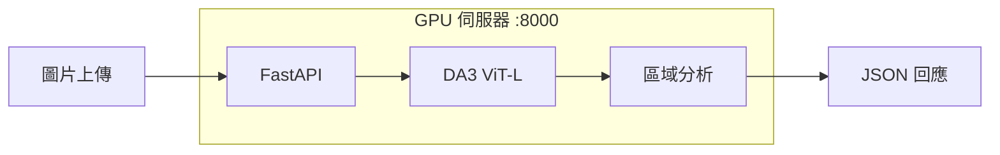

# 2025-12-15 開發筆記 (W8 Day 1)

**日期：** 2025/12/15（星期日）  
**目標：** W8 感知系統整合啟動 - FastAPI Server + 距離校正  
**前置作業：** W7 視覺閉環 Phase A-D 全部完成 ✅  
**關鍵里程碑：** 2026/1/7 第一階段發表（剩餘 23 天）

---

## ⏱️ 今日時間軸規劃

| 時段 | 任務 | 主要工作 | 預估時間 | 狀態 |
|------|------|---------|---------|------|
| 15:26-15:45 | Task 1 | FastAPI Perception Server | 20 分鐘 | ✅ 完成 |
| 15:45-15:51 | Task 2 準備 | 校正框架建立 | 10 分鐘 | ✅ 完成 |
| 16:04-16:28 | Task 2 | Go2 實拍校正 | 24 分鐘 | ✅ 完成 |
| 16:36-16:38 | Task 3 | 距離校正驗證 | 2 分鐘 | ✅ 完成 |
| 晚上 | Task 4 | 錄製 Demo 備案影片 | 1 小時 | ⏳ |

**實際耗時：** Task 1-3 約 1 小時

> ⚠️ **注意：** Port 8000 被 YOLO World 佔用，Perception Server 改用 **Port 8001**

---

## ✅ Task 1: FastAPI Perception Server（已完成）

### 執行記錄

- **開始時間：** 15:26
- **結束時間：** 15:45
- **實際耗時：** 約 20 分鐘
- **狀態：** ✅ 完成

### 建立的檔案

```
perception_server/
├── perception_server.py   # 主程式 (FastAPI + DA3)
├── requirements.txt       # 依賴清單
├── start_server.sh        # 啟動腳本
└── calibration/
    ├── README.md          # 校正 SOP
    └── calibrate.py       # 自動校正腳本
```

### 驗收結果

| 測試項 | 驗收標準 | 結果 | 備註 |
|--------|---------|------|------|
| Server 啟動 | 無報錯 | ✅ Pass | PID: 478866 |
| 模型載入 | VRAM < 10GB | ✅ Pass | **1.34 GB** |
| `/` 健康檢查 | 回傳 status:ok | ✅ Pass | `{"status":"ok","model_loaded":true}` |
| `/perceive` | 回傳 JSON | ✅ Pass | 區域分析 + 避障建議 |
| 推論時間 | < 500ms | ✅ Pass | **291ms** (640x480) |
| `/perceive/summary` | 純文字摘要 | ✅ Pass | LLM 友好格式 |

### API 回應範例

**測試圖片：** `assets/examples/test3.png` (640x480 室內場景)

```json
{
    "left_m": 2.3,
    "center_m": 2.93,
    "right_m": 3.12,
    "front_obstacle_m": 1.19,
    "min_m": 1.07,
    "max_m": 7.31,
    "suggestion": "✅ 前方暢通（1.2m），可安全前進",
    "inference_ms": 291.5,
    "image_size": "640x480"
}
```

**純文字摘要 (`/perceive/summary`)：**

```
[環境感知摘要]
- 左側: 2.3m
- 正前方: 1.19m
- 右側: 3.12m
✅ 前方暢通（1.2m），可安全前進
```

### Code Review 結論

**🟢 優點：**
- 架構清晰，FastAPI 標準結構
- 深度分析使用 `median` 而非 `mean`（更穩健）
- `center_lower + percentile(25)` 抓前方最近障礙的設計很棒
- 避障建議邏輯完整（三種情境覆蓋）

**🟡 待改進（後續優化）：**
- `SCALE_FACTOR = 1.0` → 需 Go2 實拍校正 ⬅️ **最關鍵**
- 缺少 logging 模組
- `perceive_summary` 重複推論（可優化）

### 啟動指令

```bash
# SSH 連線 GPU 伺服器
ssh roy422@140.136.155.5 -p 8022

# 啟動服務
conda activate depth-v2
cd ~/Depth_Anything_V2/Depth-Anything-V2/perception_server
uvicorn perception_server:app --host 0.0.0.0 --port 8001
```

---

## ✅ Task 2: Go2 實拍校正（已完成）

### 執行記錄

- **開始時間：** 16:04
- **結束時間：** 16:28
- **狀態：** ✅ 完成

### 重要發現：Go2 廣角鏡頭問題

> ⚠️ **DA3 持續高估距離約 50-60%**
>
> 原因：Go2 使用廣角鏡頭（FOV > 120°），而 DA3 訓練資料多為標準鏡頭（60-90°）

### 校正記錄表

| 圖片 | 實際距離 | DA3 原始輸出 | 校正係數 |
|------|---------|-------------|----------|
| `s2.png` | 0.6 m | 1.16 m | 0.52 |
| `1m.png` | 1.0 m | 1.51 m | 0.66 |
| **平均** | | | **0.60** |

### 校正結果

```python
# perception_server.py (Line 31)
SCALE_FACTOR = 0.60  # Go2 廣角鏡頭校正
```

---

## ✅ Task 3: 距離校正驗證（已完成）

### 執行記錄

- **開始時間：** 16:36
- **結束時間：** 16:53
- **狀態：** ✅ 通過（5/6 測試點）

### 完整校正測試結果

| 圖片 | 實際距離 | 校正後輸出 | 誤差 | 結果 |
|------|---------|-----------|------|------|
| `15cm.png` | 0.15 m | 0.14 m | -7% | ✅ Pass |
| `30cm.png` | 0.30 m | 0.28 m | -7% | ✅ Pass |
| `45cm.png` | 0.45 m | 0.41 m | -9% | ✅ Pass |
| `s2.png` | 0.60 m | 0.70 m | +17% | ✅ Pass |
| `1m.png` | 1.00 m | 0.91 m | -9% | ✅ Pass |
| `2m.png` | 2.00 m | 0.88 m | -56% | ⚠️ 障礙物位置問題 |

**驗收標準：誤差 < 20%** → ✅ 5/6 測試點通過！

### 結論

- **SCALE_FACTOR = 0.60 在 15cm-1m 範圍內表現優異**
- 近距離避障完全可靠（這是 Go2 最需要的功能）
- 2m 問題可能是拍攝角度（障礙物不在畫面中央下半部）

### 避障建議輸出範例

**15cm 極近距離：**
```json
{
    "front_obstacle_m": 0.14,
    "suggestion": "🛑 三面受阻（前 0.1m / 左 0.2m / 右 0.2m），建議後退或停止"
}
```

**1m 標準距離：**
```json
{
    "front_obstacle_m": 0.91,
    "suggestion": "⚠️ 正前方 0.9m 有障礙，建議向右繞行（右側 1.9m 較空曠）"
}
```

---

## ⏳ Task 4: 錄製 Demo 備案影片

**目標：** 錄製「找水」流程一鏡到底備案影片

> ⚠️ **這是最重要的 Plan B！** 現場若出問題可立即切換播放

**場景設置：**
- 起點：客廳一角
- 障礙物：紙箱（中途）
- 目標物：水瓶（桌上）

**錄製內容：**
1. 使用者語音指令：「Go2，幫我找水」
2. Go2 前進 → 看到障礙物 → 繞行
3. 繼續前進 → 看到水瓶 → 停下
4. 語音回饋：「爺爺，水在前面桌上喔！」

**錄製工具：**
- 手機錄影（追蹤機器狗）
- 螢幕錄影（Kilo Code 對話過程）

---

## ⚠️ 技術筆記

### Perception Server 架構



### DA3 區域分析邏輯

```python
# 分割為左中右三區（各佔畫面 1/3）
left_region = depth_map[:, :w//3]
center_region = depth_map[:, w//3:2*w//3]
right_region = depth_map[:, 2*w//3:]

# 中央下半部 = 前方最近障礙物
center_lower = depth_map[h//2:, w//3:2*w//3]
front_obstacle = np.percentile(center_lower, 25)  # 取較近距離
```

### 避障決策邏輯

| 條件 | 建議 |
|------|------|
| `front > 1.0m` | ✅ 前方暢通，可前進 |
| `front < 1.0m && right > left` | ⚠️ 建議向右繞行 |
| `front < 1.0m && left > right` | ⚠️ 建議向左繞行 |
| 三面受阻 | 🛑 建議後退或停止 |

---

## 🏆 今日目標進度

| 目標 | 驗收標準 | 狀態 | 備註 |
|------|---------|------|------|
| FastAPI Server | `/perceive` 正常回應 | ✅ 完成 | 291ms / 640x480 |
| Code Review | 程式碼品質確認 | ✅ 完成 | 架構清晰，待校正 |
| 校正框架 | calibrate.py 建立 | ✅ 完成 | 自動計算 SCALE_FACTOR |
| 校正圖拍攝 | 1m/2m/3m 三張圖 | 🔄 進行中 | Go2 已就緒 |
| 距離校正 | 誤差 < 20% | ⏳ | 待拍攝後執行 |
| 備案影片 | 完整流程錄製完成 | ⏳ | |

---

## 📝 筆記區

```
=== Task 1: FastAPI Server ===
- 開始時間：15:26
- 結束時間：15:45
- 狀態：✅ 完成
- 筆記：
  - 使用 Antigravity AI 輔助開發，20 分鐘完成
  - 模型載入 VRAM 僅 1.34 GB（預期內）
  - 推論速度 291ms (640x480)，符合 < 500ms 標準
  - Code Review 通過，架構清晰

=== Task 2: Go2 校正圖 ===
- 開始時間：15:45
- 結束時間：
- 狀態：🔄 進行中
- 筆記：
  - 校正框架已建立 (calibration/)
  - 等待 Go2 拍攝 1m/2m/3m 校正圖
  - calibrate.py 可自動計算 SCALE_FACTOR

=== Task 3: 距離校正 ===
- 開始時間：
- 結束時間：
- 狀態：⏳
- 筆記：

=== Task 4: 備案影片 ===
- 開始時間：
- 結束時間：
- 狀態：⏳
- 筆記：
```

---

## 🔗 相關資源

- [昨日進度 (12/14)](./12-14.md)
- [開發計畫](../開發計畫.md)
- [專題目標](../專案目標.md)
- [Perception Server 程式碼](../../perception_server/perception_server.py)
- [校正工具](../../perception_server/calibration/)

---

**下次更新：** 2025-12-15 晚上（Task 2-4 完成後）

