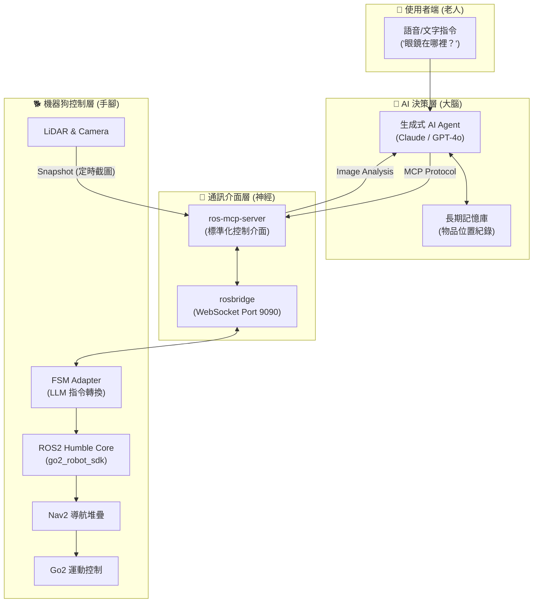
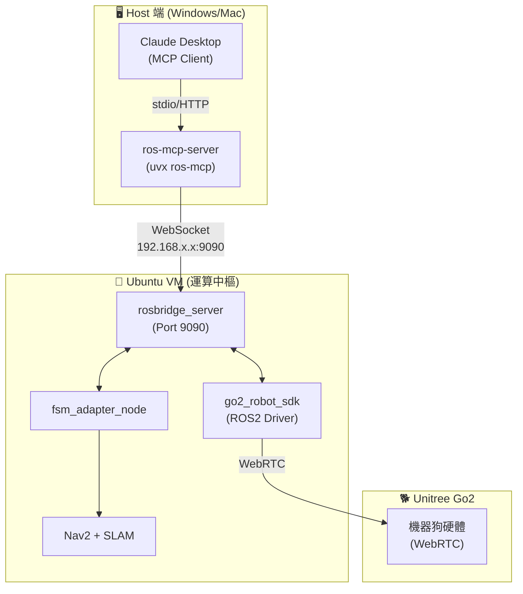

# 專題計畫書：「老人與狗」

## 基於 MCP 架構與生成式 AI 的 Go2 機器狗居家陪伴與尋物系統

**專題名稱：** 老人與狗 (Elder and Dog)  
**文件版本：** v3.1 (語意導航版)  
**修訂日期：** 2025年12月13日  
**關鍵里程碑：** 2026/1/7 第一階段發表（剩餘 25 天）

---

## 0. 當前狀態摘要（2025/12/13 更新）

### 📍 當前週次：W7 Day 5（第二個月）

**專案整體進度：約 70%**

### ✅ 已完成項目

| 模組 | 進度 | 說明 |
|------|------|------|
| **ROS2 環境** | 100% | Ubuntu 22.04 + ROS2 Humble + go2_robot_sdk |
| **SLAM + Nav2** | 100% | slam_toolbox + Nav2 導航堆疊驗證完成 |
| **感測器整合** | 100% | LiDAR/Camera/IMU 資料串流正常 |
| **雙橋接網路** | 100% | Mac VM ↔ Windows ↔ Go2 架構完成 |
| **Phase 1.5 自動化腳本** | 100% | `phase1_test.sh` 一鍵測試 |
| **Foxglove 視覺化** | 100% | WebSocket Port 8765 連線成功 |
| **ros-mcp-server 整合** | 100% | rosbridge + MCP 控制鏈驗證成功 |
| **snapshot_service** | 100% | 相機截圖服務運作正常 |
| **move_for_duration** | 100% | 定時移動服務（安全限速）✨ 新增 |

### 🔄 進行中項目（W7）

| 模組 | 進度 | 下一步 |
|------|------|--------|
| **移動控制測試** | 80% | Phase A 完成，Phase B/C/D 明天繼續 |
| **視覺閉環** | 60% | LLM 可拍照分析，需優化避障 Prompt |
| **LLM 模型評估** | 100% | Mistral Large / Amazon Nova 2 Lite 為最佳選擇 |

### 🎯 語意導航策略（12/13 確立）

**核心理念：** 不使用傳統座標轉換，改用 LLM 多模態融合

```
Camera + LiDAR 摘要 → Context Builder → LLM 語意決策 → 執行
```

**關鍵設計：**
- ❌ 不給 LLM 吃「生肉」（360 個 /scan 浮點數）
- ✅ 給 LLM 吃「熟食」（「前方 0.5m 有障礙物」）
- ✅ 容忍無線低頻 /scan（~1-2 Hz）

> ⚠️ **約束：** 非 EDU 版機器狗，必須使用無線連線，無法使用 Ethernet 提升 /scan 頻率

---

## I. 專案願景與核心價值

### 1. 願景

讓 Go2 機器狗成為「懂爺爺奶奶」的 AI 居家夥伴，具備**語意理解**、**視覺感知**與**主動關懷**能力，解決長者「物品遺失的困擾」與「缺乏情感陪伴」兩大痛點。

### 2. 核心理念：「老人與狗」

這不只是一個會移動的工具，而是一隻能：
- **聽得懂人話：** 理解模糊指令（如「幫我找眼鏡」）
- **看得懂環境：** 透過 VLM 辨識居家物品與障礙物
- **找得到東西：** 在家中自主巡視，引導長者尋回物品

### 3. 技術定位

| 項目 | 傳統方案 | 本專題方案 |
|------|---------|-----------|
| 指令理解 | 程式化指令 | **自然語言 (LLM)** |
| 視覺處理 | 即時串流 | **Snapshot + VLM** |
| 控制介面 | 自訂協定 | **MCP 標準協定** |
| 導航策略 | 純座標導航 | **LLM 決策 + Nav2 執行** |

---

## II. 系統架構

### 1. 高階架構圖



### 2. 資料流詳解

```
使用者指令 "幫我找水"
     ↓
LLM (Claude/GPT) 理解意圖
     ↓ MCP Protocol
ros-mcp-server 轉譯
     ↓ WebSocket
rosbridge_server
     ↓ ROS2 Topics
FSM Adapter 節點
     ├── /cmd_vel（簡單移動）
     └── Nav2 Action（複雜導航）
           ↓
     Go2 機器狗執行
           ↓
Camera 截圖 → ros-mcp-server → LLM 視覺分析
           ↓
LLM："前方有障礙物，轉向中..."
```

### 3. 關鍵技術選型

| 模組 | 技術方案 | 選擇理由 |
|------|---------|---------|
| **機器人大腦** | Claude 3.5 / GPT-4o | 強大的語意理解與推論能力 |
| **通訊協定** | MCP (Model Context Protocol) | LLM 直接呼叫 ROS2 功能的標準介面 |
| **MCP Server** | ros-mcp-server | 開源、支援 ROS1/ROS2、**支援 Action**、有 Go2 範例 |
| **機器人平台** | Unitree Go2 + ROS2 Humble | 業界標準，穩定性高 |
| **視覺方案** | Snapshot + VLM | 解決即時串流的高延遲問題 |
| **導航框架** | Nav2 + slam_toolbox | 成熟的 SLAM 與導航套件 |
| **網路拓樸** | 雙橋接網路 | Windows ↔ VM ↔ Go2 低延遲通訊 |

### 4. 座標系統約定

| 座標框架 | 說明 | 注意事項 |
|---------|------|----------|
| `map` | SLAM 世界座標系 | Nav2 目標點使用此框架 |
| `base_link` | 機器狗本體中心 | 運動控制參考點 |
| `front_camera` | 前置相機 | ⚠️ **不是** `camera_link`（go2.urdf 定義） |
| `camera_link` | RealSense 相機 | 僅 `go2_with_realsense.urdf` 使用 |

> ⚠️ **TF 查詢注意：** 使用預設 URDF 時，相機框架為 `front_camera`，不是 `camera_link`！

### 4. 網路拓樸架構圖



---

## III. 執行階段與時程規劃

### 第一階段：核心驗證 (Proof of Concept)

**時間：** 2025/12/06 ～ 2026/1/7（發表日）  
**目標：** 展示「AI 聽懂指令並控制機器狗」的 MVP

#### W6 (12/2-12/8)：環境重構與 MCP 串接

- [x] ros-mcp-server Clone 與研究完成
- [x] 安裝 rosbridge_server
- [x] 測試 uvx ros-mcp 連線
- [x] **里程碑：** Claude Desktop 輸入「往前走」，機器狗成功移動 ✅

#### W7 (12/9-12/15)：視覺閉環 (Visual Loop)

- [x] 實作 `/capture_snapshot` 服務
- [x] 讓 LLM 讀取圖片並描述環境
- [x] 實作 `/move_for_duration` 定時移動服務
- [x] Phase A 移動控制測試（前進/後退/左轉/右轉/緊急停止）
- [ ] Phase B Odometry 精確移動測試
- [ ] Phase C 手動避障流程測試
- [ ] Phase D Kilo Code 整合測試
- [ ] **里程碑：** AI 看到障礙物，自主決定「轉向」

#### W8 (12/16-12/22)：尋物情境整合

- [ ] 設計 1/7 展示路線（客廳場景）
- [ ] 調整 Prompt（貼心機器狗角色 + 自主避障）
- [ ] 加入 YOLO 物件偵測，提供目標標註（如可行）
- [ ] **里程碑：** 完成「找水」完整流程

#### W9-W10 (12/23-1/6)：穩定性測試與 Demo 準備

- [ ] 壓力測試（連續運行 10 分鐘）
- [ ] 錄製備案影片 (Plan B)
- [ ] 實機演練 Demo 腳本
- [ ] 準備簡報與口頭報告
- [ ] **里程碑：** Demo 成功率 > 80%

### 第二階段：語意導航進化 (寒假 1月中-2月)

- [ ] **Context Builder 節點**（核心功能）
  - 雷達摘要：360 數據 → 「前方 0.5m 有障礙物」
  - 方位提示：「目標在 1 點鐘方向，約 2 公尺」
- [ ] 開發 FastAPI 後端，取代 Claude Desktop
- [ ] 開發 Web 前端（說話按鈕 + 影像回傳）
- [ ] 物品位置記憶庫（SQLite）

### 第三階段：終極智慧化 (下學期 3-6月)

- [ ] LangGraph 多代理人架構
  - Supervisor Agent（總指揮）
  - Companion Agent（聊天陪伴）
  - Navigation Agent（專業導航）
- [ ] 語音整合（Whisper STT + TTS）
- [ ] 行為學習與個人化

---

## IV. 1/7 專題發表 Demo 劇本

### 場景設置

模擬居家客廳：
- 地上有一個紙箱（障礙物）
- 桌上放著一瓶水（目標物）

### 演示流程

1. **指令下達**
   > 「Go2，我口渴了，幫我找找桌上的水。」

2. **AI 思考與規劃（螢幕展示）**
   > "收到指令：找水。執行策略：先巡視環境。"
   > "呼叫 `get_topics`... 準備移動。"

3. **避障展示**
   - 機器狗前進，遇到紙箱
   - AI 截圖分析：「前方發現障礙物（紙箱），規劃繞行路徑...」
   - 機器狗左轉繞過

4. **發現目標**
   - 機器狗看到桌子
   - AI：「發現桌子，上面有一瓶水。確認為目標物。」

5. **任務完成**
   - 機器狗走到桌前停下
   - AI：「爺爺，水在前面的桌子上喔！」

---

## V. 風險管理與應對方案

| 風險 | 等級 | 緩解措施 (Plan A) | 備案 (Plan B) |
|------|------|------------------|---------------|
| **現場網路不穩** | 🔴 高 | 手機熱點 + 本地 VM | 預錄「一鏡到底」影片 |
| **LLM 產生幻覺** | 🟡 中 | Safety Filter（限速限範圍） | 預寫 Prompt 腳本 |
| **影像傳輸延遲** | 🟡 中 | Snapshot 機制 | 降低解析度 |
| **MCP Action 支援** | 🟡 中 | W7 Day 1 驗證 `send_action_goal()` | 失敗則啟動 FSM Adapter (Plan B) |
| **Demo 實機故障** | 🟡 中 | 檢查電池與硬體 | Isaac Sim 模擬器展示 |

> 💡 **Action 支援說明：** ros-mcp-server 提供 `send_action_goal()` 函式，但需驗證 rosbridge/rosapi 是否提供完整的 action services。若驗證失敗，則開發 FSM Adapter 作為轉接層。

### 安全層建議（重要！）

> ⚠️ **不建議讓 LLM 直接發布 `/cmd_vel`！**
>
> **風險：** LLM 可能產生幻覺，輸出 `linear.x = 10.0`（它可能以為單位是 cm/s，但 ROS 是 m/s），造成機器狗暴衝。
>
> **推薦架構：**
> ```
> LLM 輸出： {"action": "move", "direction": "forward", "distance": 1.0}
>      ↓
> Safety Layer (FSM Adapter)： 轉換為安全的 cmd_vel，限制最大速度與加速度
>      ↓
> /cmd_vel
> ```

---

## VI. 預期貢獻與創新點

1. **技術創新：** 率先導入 **MCP (Model Context Protocol)** 於 ROS2 機器人控制
2. **架構創新：** 提出 **LangGraph 多代理人架構** 的未來藍圖
3. **社會價值：** 聚焦於 **「老人照護」** 議題，賦予機器人溫度與人文關懷

---

## VII. 附錄：技術名詞解釋

| 術語 | 說明 |
|------|------|
| **MCP** | Model Context Protocol，Anthropic 提出的 LLM 與外部工具通訊標準 |
| **rosbridge** | ROS2 的 WebSocket 橋接器，讓非 ROS 程式可與 ROS 通訊 |
| **VLM** | Vision Language Model，視覺語言模型 |
| **Snapshot** | 定時截圖策略，取代即時影片串流以降低延遲 |
| **FSM** | Finite State Machine，有限狀態機 |
| **Nav2** | ROS2 Navigation Stack，導航框架 |
| **LangGraph** | LangChain 的多代理人協作框架 |

---

## VIII. 相關文件

- [開發計畫（時程規劃）](./開發計畫.md)
- [ros-mcp-server 技術研究報告](../../ros-mcp-server/README.md)
- [Phase 1 執行指南](../01-guides/slam_nav/README.md)
- [CycloneDDS 配置指南](../01-guides/cyclonedds-config-guide.md)

---

**祝專題順利！🐕**
