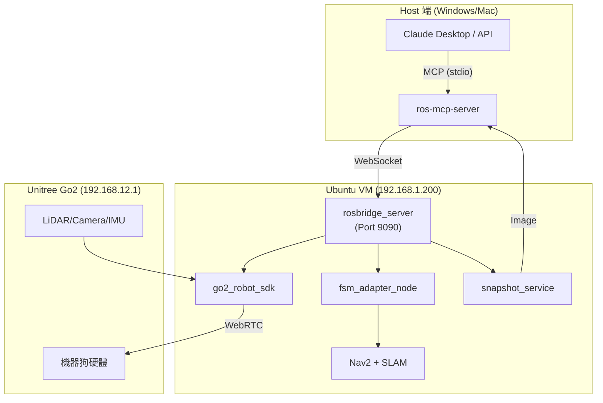
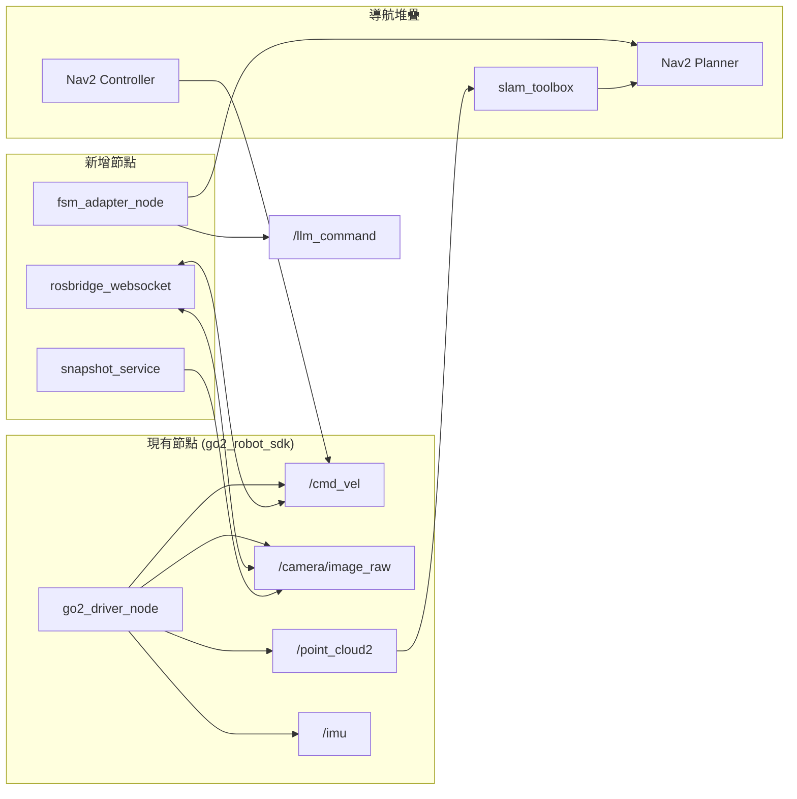
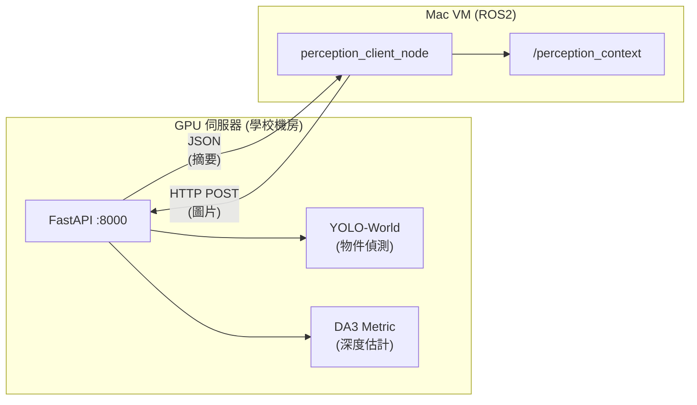

# Go2 智慧尋物系統開發計畫

**報告日期：** 2025/12/06（MCP 架構版本）  
**文件版本：** v3.0 (MCP Pivot)  
**分析基礎：** ros-mcp-server 技術研究 + 2025/12/03 會議決議

---

## 1. 開發計畫總覽

### 1.1 架構轉型說明

| 項目 | 原計畫 (v2.0) | 新計畫 (v3.0) | 變更理由 |
|------|--------------|--------------|---------|
| **視覺處理** | COCO VLM 本地推論 | LLM Vision (Snapshot) | 解決延遲問題，語意理解更強 |
| **控制介面** | 自訂 ROS2 節點 | MCP 標準協定 | 開發效率高，擴充性強 |
| **決策邏輯** | FSM 狀態機 | LLM Agent | 能處理模糊指令 |
| **座標轉換** | LiDAR 投影 + tf2 | LLM 視覺判斷 + Nav2 | 降低技術複雜度 |

### 1.2 現況評估

| 模組 | 進度 | 備註 |
|------|------|------|
| **基礎建設 (ROS2 + SDK)** | ✅ 100% | go2_robot_sdk 穩定運行 |
| **SLAM + Nav2** | ✅ 100% | robot.launch.py 已驗證 |
| **感測器整合** | ✅ 100% | LiDAR/Camera/IMU Topic 正常 |
| **雙橋接網路** | ✅ 100% | Mac VM ↔ Windows ↔ Go2 |
| **ros-mcp-server 研究** | ✅ 100% | Clone 完成，架構分析完畢 |
| **rosbridge 部署** | ✅ 100% | Port 9090 運行正常 (12/6) |
| **MCP 串接驗證** | ✅ 100% | /cmd_vel + /capture_snapshot 成功 (12/8) |
| **snapshot_service** | ✅ 100% | 可透過 MCP 擷取 JPEG (12/7) |
| **FSM Adapter** | ⏳ 待評估 | 可能不需要，MCP 可直接控制 |

---

## 2. 系統架構

### 2.1 整合架構圖



### 2.2 ROS2 節點通訊架構



### 2.3 模組職責說明

| 模組 | 檔案位置 | 功能 |
|------|---------|------|
| **rosbridge_server** | apt 安裝 | WebSocket 橋接，讓 ros-mcp-server 能存取 ROS2 |
| **ros-mcp-server** | `ros-mcp-server/` | MCP 協定實作，**支援 Action**，LLM 透過此控制 ROS2 |
| **snapshot_service** | `src/vision/snapshot_service.py` | 擷取相機圖像，壓縮為 JPEG 回傳 |

### 2.4 座標系統約定（重要！）

**關鍵座標框架：**

| 座標框架 | 說明 | 注意事項 |
|---------|------|----------|
| `map` | SLAM 世界座標系 | Nav2 目標點使用此框架 |
| `odom` | 里程計座標系 | 相對位移追蹤 |
| `base_link` | 機器狗本體中心 | 運動控制參考點 |
| `front_camera` | 前置相機 | ⚠️ **不是** `camera_link` |
| `lidar_link` | LiDAR 座標系 | 點雲資料來源 |

> ⚠️ **注意：** 相機座標框架名稱為 `front_camera`，不是常見的 `camera_link`。
> 所有 TF 查詢必須使用正確名稱，否則會失敗。

```python
# 正確用法
transform = tf_buffer.lookup_transform('map', 'front_camera', time)

# 錯誤用法（會失敗！）
transform = tf_buffer.lookup_transform('map', 'camera_link', time)  # ❌
```

---

## 3. 詳細時程規劃

### W6 (12/2-12/8)：MCP 基礎串接 ✅ 已完成

**目標：** 讓 LLM 能透過 MCP 控制機器狗基本移動

| 日期 | 任務 | 驗收標準 | 狀態 |
|------|------|---------| -----|
| 12/6 (五) | 安裝 rosbridge_server | `ros2 launch rosbridge_server rosbridge_websocket_launch.xml` 成功 | ✅ |
| 12/7 (六) | 開發 snapshot_service | `/capture_snapshot` 回傳 base64 JPEG | ✅ |
| 12/7 (六) | 配置 Kilo Code MCP | ros-mcp-server 連線成功 | ✅ |
| 12/8 (日) | 驗證 /cmd_vel 控制 | Kilo Code 輸入「往前走」，機器狗移動 | ✅ |
| 12/8 (日) | 驗證 /capture_snapshot | Kilo Code 呼叫服務，取得 JPEG | ✅ |

**W6 成果摘要：**
- MCP 控制鏈完整驗證：`Kilo Code → ros-mcp-server → rosbridge → ROS2 → Go2`
- snapshot_service 開發完成，支援 MCP 呼叫
- Nav2 導航部分成功（待優化 /scan 頻率）

**技術細節：**

```bash
# VM 端安裝
sudo apt install ros-humble-rosbridge-server

# 啟動 rosbridge
ros2 launch rosbridge_server rosbridge_websocket_launch.xml

# 啟動 snapshot_service（必須單獨啟動）
ros2 run go2_robot_sdk snapshot_service

# Host 端配置 Claude Desktop (~/.config/Claude/claude_desktop_config.json)
{
  "mcpServers": {
    "ros-mcp-server": {
      "command": "uvx",
      "args": ["ros-mcp", "--transport=stdio"]
    }
  }
}
```

---

### W7 (12/9-12/15)：視覺閉環 + Action 驗證

**目標：** LLM 能看見環境並透過 Action 控制導航

| 日期 | 任務 | 驗收標準 |
|------|------|---------|
| 12/9 | **優先驗證 MCP Action** | `send_action_goal('/navigate_to_pose', ...)` 成功 |
| 12/10-11 | 開發 snapshot_service | `/capture_snapshot` 回傳 base64 圖片 |
| 12/12-13 | YOLO vs COCO 快速測試 | 選定 VLM 方案 |
| 12/14-15 | 視覺閉環整合 | LLM 描述「我看見前方有障礙物」 |

**W7 Day 1 優先測試腳本（12/9）：**

```python
# 測試 MCP Action 控制 Nav2
send_action_goal(
    action_name="/navigate_to_pose",
    action_type="nav2_msgs/action/NavigateToPose",
    goal={
        'pose': {
            'header': {'frame_id': 'map'},
            'pose': {
                'position': {'x': 1.0, 'y': 0.0, 'z': 0.0},
                'orientation': {'w': 1.0}
            }
        }
    },
    timeout=30.0
)
```

> ✅ **若成功：** 省下 5-7 天 FSM Adapter 開發時間！
> ⚠️ **若失敗：** 立即啟動備案，開發簡化版狀態管理器。

**snapshot_service 規格：**

> 💡 **圖像壓縮建議：**
> - Claude 不需要 4K 畫質就能辨識「水瓶」或「紙箱」
> - 建議 Resize 到 **640x480** 甚至更小，JPEG 壓縮品質設為 **50-70**
> - **原因：** Base64 編碼後字串很長，佔用大量 Context Token，增加 Claude 思考時間

```python
# snapshot_service.py
from sensor_msgs.msg import Image
from std_srvs.srv import Trigger
import cv2
import base64

# 圖像壓縮設定（優化 Token 使用）
TARGET_WIDTH = 640
TARGET_HEIGHT = 480
JPEG_QUALITY = 60  # 50-70 建議

class SnapshotService(Node):
    def __init__(self):
        super().__init__('snapshot_service')
        self.bridge = CvBridge()
        self.latest_image = None
        self.create_subscription(Image, '/camera/image_raw', self.image_callback, 10)
        self.create_service(Trigger, '/capture_snapshot', self.capture_callback)

    def image_callback(self, msg):
        self.latest_image = msg

    def capture_callback(self, request, response):
        if self.latest_image:
            cv_image = self.bridge.imgmsg_to_cv2(self.latest_image, 'bgr8')
            # Resize 以減少 Token 使用
            resized = cv2.resize(cv_image, (TARGET_WIDTH, TARGET_HEIGHT))
            # JPEG 壓縮
            _, jpeg = cv2.imencode('.jpg', resized, [cv2.IMWRITE_JPEG_QUALITY, JPEG_QUALITY])
            response.message = base64.b64encode(jpeg.tobytes()).decode()
            response.success = True
        return response
```

**fsm_adapter_node 規格（Safety Layer）：**

> ⚠️ **安全層設計重點：**
> - **不要讓 LLM 直接發布 `/cmd_vel`！**
> - LLM 可能幻覺輸出 `linear.x = 10.0`（它以為 cm/s，但 ROS 是 m/s）
> - FSM Adapter 作為 Safety Layer，限制最大速度與加速度

```python
# fsm_adapter.py (Safety Layer)
from std_msgs.msg import String
from geometry_msgs.msg import Twist
from nav2_msgs.action import NavigateToPose
import json

# 安全限制
MAX_LINEAR_SPEED = 0.5   # m/s
MAX_ANGULAR_SPEED = 1.0  # rad/s

class FSMAdapter(Node):
    def __init__(self):
        super().__init__('fsm_adapter')
        self.cmd_vel_pub = self.create_publisher(Twist, '/cmd_vel', 10)
        self.create_subscription(String, '/llm_command', self.command_callback, 10)
        self.nav2_client = ActionClient(self, NavigateToPose, 'navigate_to_pose')

    def command_callback(self, msg):
        try:
            cmd = json.loads(msg.data)  # {"action": "move", "direction": "forward", "distance": 1.0}
        except json.JSONDecodeError:
            cmd = {'action': msg.data.lower()}  # 純文字指令
        
        if cmd.get('action') == 'move':
            self.send_velocity_safe(
                linear=min(cmd.get('speed', 0.3), MAX_LINEAR_SPEED),
                angular=0.0
            )
        elif cmd.get('action') in ['forward', 'move']:
            self.send_velocity_safe(0.3, 0.0)
        elif cmd.get('action') == 'turn_left':
            self.send_velocity_safe(0.0, min(0.5, MAX_ANGULAR_SPEED))
        elif cmd.get('action') == 'stop':
            self.send_velocity_safe(0.0, 0.0)
        elif cmd.get('action') == 'goto':
            self.send_nav2_goal(cmd.get('x', 0), cmd.get('y', 0))

    def send_velocity_safe(self, linear, angular):
        """Safety-limited velocity publishing"""
        twist = Twist()
        twist.linear.x = max(-MAX_LINEAR_SPEED, min(linear, MAX_LINEAR_SPEED))
        twist.angular.z = max(-MAX_ANGULAR_SPEED, min(angular, MAX_ANGULAR_SPEED))
        self.cmd_vel_pub.publish(twist)
```

---

### W8 (12/16-12/22)：尋物情境整合 + 感知系統升級

**目標：** 實現「幫我找眼鏡」完整流程，並提升避障成功率至 80%+

| 日期 | 任務 | 驗收標準 |
|------|------|---------|
| 12/14-15 | GPU 伺服器：安裝 DA3 + YOLO-World | FastAPI Server 可回應 `/perceive` |
| 12/16 | Mac VM：開發 perception_client_node | `/perception_context` 正常發布 |
| 12/17 | 整合測試 + 更新 mcp_system_prompt.md | LLM 可訂閱感知摘要 |
| 12/18-19 | 設計 1/7 展示路線 | 客廳場景：起點 → 障礙物 → 目標物 |
| 12/20-21 | 避障驗證測試 | 5 次中 4 次成功（80%+） |
| 12/22 | 端到端測試 | 完成「找水」完整流程 |

#### 感知系統架構 (DA3 + YOLO-World)



**技術規格：**

| 模型 | 用途 | 輸出 |
|------|------|------|
| **YOLO-World-L** | 開放詞彙物件偵測 | `{class: "水瓶", bbox: [...], conf: 0.85}` |
| **DA3METRIC-LARGE** | 真實距離估計 | 深度圖 (公尺) |

**偵測類別：** `["水瓶", "眼鏡", "藥盒", "椅子", "桌子", "紙箱", "人"]`

**感知摘要格式：**

```
[環境感知摘要]
- 正前方 0.8m：紙箱（障礙物）
- 右側 2.3m：水瓶（目標）
- 左側暢通
⚠️ 建議：向左繞行
```

> 📖 **詳細指南**：[Depth Anything V2 安裝指南](../01-guides/Depth%20Anything%20V2/depth-anything-v2-guide.md)

**LLM System Prompt 範例（含 Prompt Engineering 技巧）：**

```markdown
你是「小狗」，一隻貼心的 AI 機器狗。

## 角色設定
- 你的主人是一位年長的父父/奶奶
- 你說話要溫暖、簡短、易懂
- 你會幫主人找東西，並用簡單的話描述位置

## 座標系統（重要！）
- 你是基於 `map` 座標系思考
- 當你看到障礙物在畫面左邊，代表你需要向右旋轉
- 當你看到障礙物在畫面右邊，代表你需要向左旋轉

## 可用工具
- `subscribe_once('/camera/image_raw', 'sensor_msgs/Image')` - 看環境
- `analyze_previously_received_image()` - 分析圖片
- `publish_once('/llm_command', 'std_msgs/String', {'data': '{"action": "forward"}'})` - 發送指令

## 行為準則（Chain of Thought）
1. 收到尋物指令後，先巡視環境
2. **先輸出思考過程，再呼叫工具**：
   <thought>我看到前方有紙箱，應該左轉繞過...</thought>
3. 每移動 2-3 秒後截圖觀察
4. 找到目標物後，用溫暖的話告訴主人
```

---

### W9-W10 (12/23-1/6)：穩定性測試與 Demo 準備

**目標：** Demo 成功率 > 80%

| 日期 | 任務 | 驗收標準 |
|------|------|---------|
| 12/23-25 | 壓力測試 | 連續運行 10 分鐘無故障 |
| 12/26-28 | 錄製備案影片 | 一鏡到底成功影片 |
| 12/29-31 | 準備簡報 | PPT + 口頭報告稿 |
| 1/1-3 | 假期休息 | - |
| 1/4-6 | 實機演練 | 完整 Demo 彩排 3 次 |

**Demo 準備關鍵建議：**

> 📋 **1. 預先建圖 (Pre-mapping)**
> - **不要在 Demo 當下跑 SLAM 建圖！**
> - 請提前建好 `map` 並儲存 (`ros2 run nav2_map_server map_saver_cli -f ~/maps/demo_map`)
> - Demo 時只跑 `AMCL` (定位) + `Nav2`，降低運算負載，減少出錯機率

> 🌐 **2. 網路測試 (W6 結束前必做)**
> ```bash
> # 從 Host 端測試 rosbridge 連線
> # 安裝 wscat: npm install -g wscat
> wscat -c ws://192.168.x.x:9090
> 
> # 應該看到連線成功，可輸入 JSON 測試
> {"op": "call_service", "service": "/rosapi/topics"}
> ```
> - 確認 VM Port Forwarding 允許 9090
> - 測量延遲 (目標 < 100ms)

> 🎬 **3. 備案影片 (Plan B)**
> - 錄製「一鏡到底」成功影片
> - 若現場網路/硬體出問題，可立即切換播放
> - 影片內容：完整尋物流程 + Claude 對話截圖


## 4. 整合 Launch 檔案

### 4.1 MCP 整合 Launch

建立 `launch/mcp_integration.launch.py`：

```python
from launch import LaunchDescription
from launch.actions import IncludeLaunchDescription
from launch.launch_description_sources import PythonLaunchDescriptionSource
from launch_ros.actions import Node
from ament_index_python.packages import get_package_share_directory
import os

def generate_launch_description():
    # 現有的 Go2 驅動
    go2_launch = IncludeLaunchDescription(
        PythonLaunchDescriptionSource([
            get_package_share_directory('go2_robot_sdk'),
            '/launch/robot.launch.py'
        ])
    )

    # rosbridge (MCP 通訊橋接)
    rosbridge_node = Node(
        package='rosbridge_server',
        executable='rosbridge_websocket',
        name='rosbridge_websocket',
        parameters=[{
            'port': 9090,
            'address': '',
            'use_compression': False,
            'max_message_size': 10000000,
        }]
    )

    # FSM Adapter (LLM 指令轉換) - Plan B，僅在 MCP Action 驗證失敗時啟用
    # fsm_adapter_node = Node(
    #     package='go2_robot_sdk',
    #     executable='fsm_adapter',
    #     name='fsm_adapter',
    #     output='screen'
    # )

    # Snapshot Service (圖像擷取) - 可選，ros-mcp-server 內建 subscribe_once 亦可用
    # 用途：固定壓縮設定、解析度控制、服務化 API
    snapshot_node = Node(
        package='go2_robot_sdk',
        executable='snapshot_service',
        name='snapshot_service',
        output='screen'
    )

    return LaunchDescription([
        go2_launch,
        rosbridge_node,
        # fsm_adapter_node,  # 取消註解以啟用 (Plan B)
        snapshot_node,
    ])
```

### 4.2 使用方式

```bash
# 一鍵啟動所有節點
ros2 launch go2_robot_sdk mcp_integration.launch.py

# Host 端啟動 ros-mcp-server
uvx ros-mcp --transport stdio
```

---

## 5. 風險管理

| 風險 | 等級 | 緩解措施 | 備案 |
|------|------|---------|------|
| **rosbridge 連線不穩** | 🟡 中 | 加入重連邏輯 | 使用 Foxglove WebSocket |
| **LLM API 延遲** | 🟡 中 | Snapshot 策略 | 使用本地 LLM (Ollama) |
| **MCP Action 支援** | 🟡 中 | W7 Day 1 驗證 `send_action_goal()` | 失敗則啟動 FSM Adapter |
| **網路環境複雜** | 🟡 中 | 雙橋接配置 | HTTP Transport |
| **Demo 現場故障** | 🔴 高 | 多次彩排 | 預錄影片 |

> 💡 **Action 支援說明：** ros-mcp-server 提供 `send_action_goal()` 函式，但需驗證 rosbridge/rosapi 是否提供完整 action services。若驗證失敗，則開發 FSM Adapter 作為轉接層。

---

## 6. 資源清單

### 6.1 軟體依賴

| 套件 | 版本 | 安裝方式 |
|------|------|---------|
| ROS2 Humble | 2022.11 | apt |
| rosbridge_server | humble | `sudo apt install ros-humble-rosbridge-server` |
| ros-mcp-server | latest | `uvx ros-mcp` |
| Claude API | 3.5 Sonnet | API Key |

### 6.2 硬體需求

| 設備 | 規格 | 用途 |
|------|------|------|
| Mac (UTM VM) | Ubuntu 22.04, 8GB RAM | ROS2 運算 |
| Windows PC | RViz2 視覺化 | 開發監控 |
| Unitree Go2 | EDU 版本 | 機器狗實機 |

---

## 7. 關鍵時程里程碑

| 日期 | 里程碑 | 驗收標準 |
|------|--------|---------|
| **12/8** | MCP 基礎串接完成 | Claude 能控制機器狗移動 |
| **12/15** | 視覺閉環完成 | LLM 能看見並描述環境 |
| **12/22** | 尋物情境完成 | 「找水」流程運作 |
| **1/6** | Demo 準備完成 | 成功率 > 80% |
| **1/7** | **專題發表** | 現場演示成功 |

---

## 8. 相關文件

- [專題目標（願景與架構）](./專題目標.md)
- [ros-mcp-server 技術研究](../../ros-mcp-server/README.md)
- [ros-mcp-server Go2 範例](../../ros-mcp-server/examples/4_unitree_go2/)
- [CycloneDDS 配置指南](../01-guides/cyclonedds-config-guide.md)
- [Phase 1 測試腳本](../../phase1_test.sh)

---

**計畫更新完成！準備開始 MCP 整合。** 🚀
